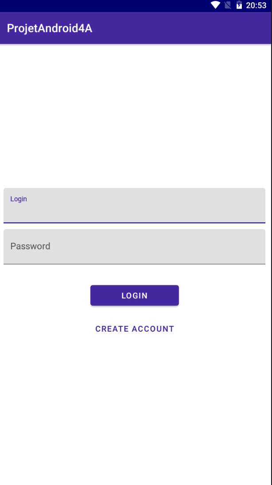
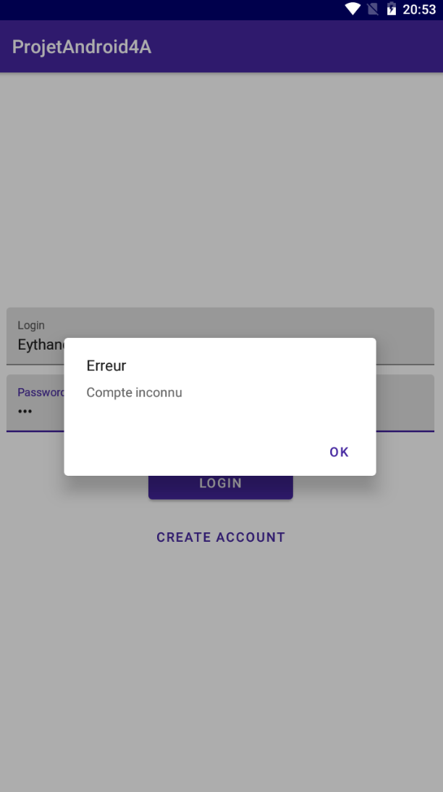
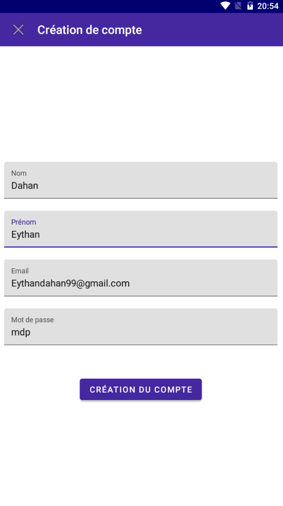
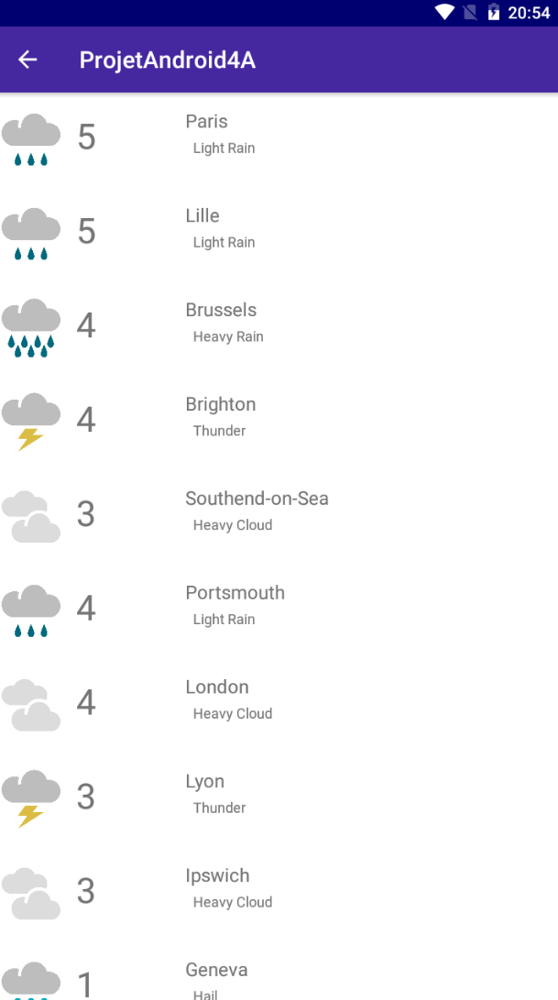

# Application rojet mobile 4A

## Présentation

C'est une application développé en kotlin pour approfondir android studio et découvrir kotlin.

Cette application affiche la météo des villes qui se situe autour de notre Paris. Pour cela elle utilise l'API metawheather.com.

## Prérequis


- Installation d'Android Studio
- Récupérer la branche master<br/>


````
https://github.com/Eythan99/ProjetMobile_4A
````

## Consignes respectées : 

- Clean Architecture & MVVM
- Appels REST
- Ecrans : 2 activités
- Affichage d'une liste dans un RecyclerView
- Possibilité de créer des comptes utilisateur
- Stockage de donnée via une base de donnée
- Fonctions supplémentaires :
  - Plusieurs appels d'API
  - Design patern


## Fonctionnalités: 

### Ecran d'accueil 

- Sur le premier écran, l'utilisateur se retrouve devant un écran de login où il peux rentrer son identifiant ainsi que sont mot de passe



- Si la paire identifiant/mot de passe est incorrect ou n'existe pas, un message d'erreur apparait



### Ecran de création de compte

- L'utilisateur peut créer un compte en appuyant sur create account
- Il devra ensuite compléter tous les champs puis cliquer sur le bouton de création du compte



### Ecran d'affichage d'un liste

- C'est ici que l'appel api est réalisé. Il peut mettre un peu de temps à arrivé car plusieur appels sont fait pour récupérer des données plus diverse
- Ainsi il y a une image pour illustrer le temps ainsi que la température et d'autres informations importante


